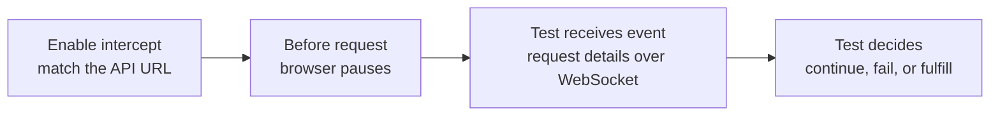

**HOW IT WORKS**

# BiDi network interception

> **BiDi helper**
>
> Code sample to be added later.

<!--
Cue: Emphasize that BiDi allows browser-initiated events. If the test does not answer, the browser waits.
-->
