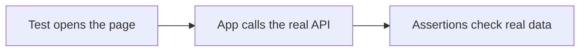

###### CASE 1

# First attempt: no mocking

Simple, but coupled to whatever the external service returns today.
Simple, but coupled to whatever the external service returns today.

<!--
Cue: Introduce the straightforward approach. Then switch to VS Code and open the no-mocks test.
-->
