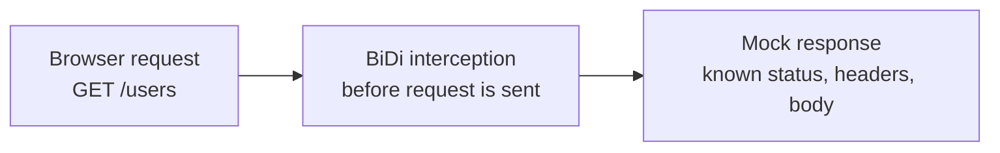

###### Client side mocks

# Client-side mocking with Selenium BiDi

The browser asks the test how to handle a matching request.
The browser asks the test how to handle a matching request.

<!--
Cue: Introduce the core idea: intercept the request and return known data before the real API is touched.
-->
