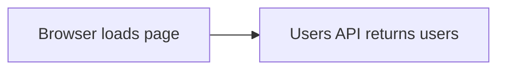

###### DEMO APPLICATION

# Meet the app

The page displays a list of users loaded from an external server through an API call.

::right::

> **Browser screenshot**
>
> Users list app with DevTools network request.
>
> Drop in `/assets/client-app.png` later.

<!--
Cue: Switch to the browser. Show the users list and the client-side API request in DevTools.
-->
