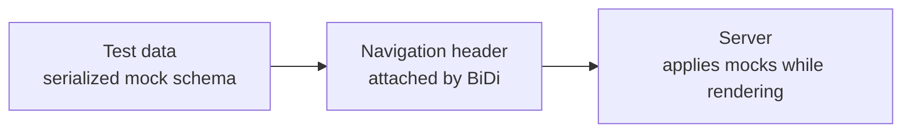

###### ALTERNATIVE

# Request Mocking Protocol

No external mock server. Each test carries its own mock data.
No external mock server. Each test carries its own mock data.

<!--
Cue: Explain that the mock configuration travels with the navigation request.
-->
