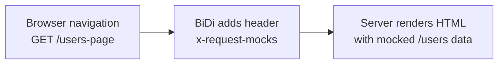

###### RMP ON THE USERS APP

# Mock the server-side API call through navigation



```http
x-request-mocks: [{"url":"/users","status":200,"body":[...]}]
```

<!--
Cue: The browser request is intercepted, but the API substitution happens on the server.
-->
