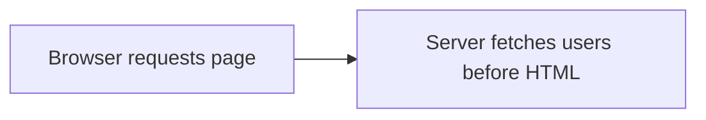

**CASE 3**

# What changes with server-side rendering?

The users are already rendered into the HTML. DevTools no longer shows a browser-side `/users` request.
The users are already rendered into the HTML. DevTools no longer shows a browser-side `/users` request.

::right::

> **SSR screenshot**
>
> Navigation request contains rendered users.
>
> Drop in `/assets/ssr-app.png` later.

<!--
Cue: Switch to the browser, enable server-side fetch, and show that the API request is absent from DevTools.
-->
