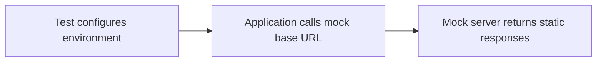

###### Traditional approach

# Use a mock server

WireMock, MockServer, Mockoon, JSON server...

| Advantage | Drawback |
| --- | --- |
| Works well locally with WireMock, MockServer, Mockoon, or JSON server. | Parallel runs, remote deployments, and per-test data isolation add complexity. |

<!--
Cue: This is a valid approach, but it becomes heavier as deployment and parallelization get more realistic.
-->
